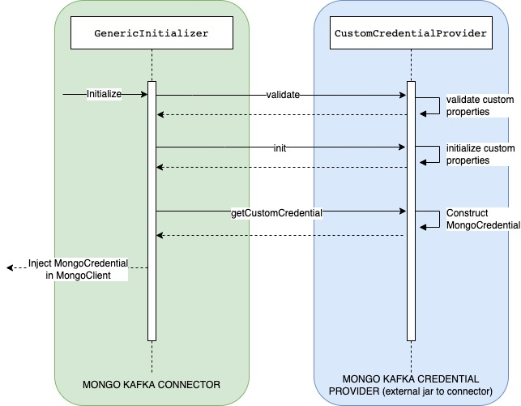
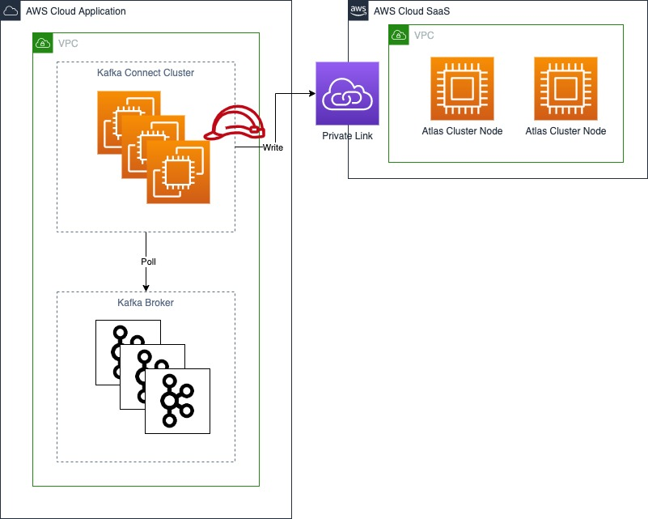

# Mongo Kafka Credential Provider

**Description**:  This repo provides an implementation of the pluggable interface [CustomCredentialProvider](https://github.com/mongodb/mongo-kafka/blob/master/src/main/java/com/mongodb/kafka/connect/util/custom/credentials/CustomCredentialProvider.java) from the [mongo-kafka](https://github.com/mongodb/mongo-kafka/) repo.

The [mongo-kafka connector](https://www.mongodb.com/docs/kafka-connector/current/) enabled a pluggable [interface](https://github.com/mongodb/mongo-kafka/commit/6e43b1d97f52be6d862328e442eea8ece5492d30) in release 1.13.0. 
This was done to enable injection of a custom credential provider in the mongo client that gets created for both the sink and the source connectors.
The implementation of this interface is not provided in the mongo-kafka connector repo as it could have different variations (such as different credential providers from AWS)
or any other credential provider that can be injected in the MongoClient.
The kafka connect framework allows us to provide custom jars that can be made available on the class path by providing a plugin location. 
This repo provides the means to build such external jar to provide the AWS authentication provider implementation.

Below is a sequence diagram that explains the initialization sequence that takes place between the connector and the external jar. For more details on how to enable the 
mongo kafka connector to use this, refer to instructions [here](https://github.com/mongodb/mongo-kafka?tab=readme-ov-file#custom-auth-provider-interface)



## How to use this repo with mongo kafka connector

1. Use ``mvn clean package`` generate a jar.
2. Add the compiled JAR to the classpath/plugin path for your Kafka workers. For more information about plugin paths, see the Confluent [documentation](https://docs.confluent.io/platform/current/connect/community.html). Refer to this [guide](https://docs.confluent.io/platform/current/connect/userguide.html#) for more information on kafka connect.

## Technical Details

**AwsAssumeRoleCredentialProvider**

This class can be used with the mongo kafka connector hosted on confluent platform within an AWS container. It uses the ``DefaultCredentialsProvider`` from aws sdk to assume a role provided in configuration, use the session credentials from the assumed role and wrap a supplier lambda in the MongoCredential object that it returns to be wrapped in the MongoClient object.

Example -



- It uses the below properties to accept an AWS roleArn, an AWS region and an AWS session name. 
  ````
  mongodbaws.auth.mechanism.roleArn
  mongodbaws.auth.mechanism.region
  mongodbaws.auth.mechanism.roleSessionName
  ````
- It validates that the roleArn is always passed and defaults region (to us-east-1) and role session name (to MONGO-CONNECTOR-SESSION-{random UUID}) if they are not passed.

## Tests and Coverage

- Unit tests can be located at ``com.evernorth.mongo.kafka.auth.AwsAssumeRoleCredentialProviderTests``
- Jacoco plugin is used for code coverage

## Dependencies

This repo uses the below jars

| Dependency            | jar                                    | version  |
|-----------------------|----------------------------------------|----------|
| AWS SDK               | software.amazon.awssdk.sts             | 2.25.14  | 
| Mongo Kafka Connector | org.mongodb.kafka.mongo-kafka-connect  | 1.13.0   |

## Limitations

The external jar that this repo produces has been tested with Confluent platform hosted on AWS EC2 instances. It has not been tested on confluent cloud.

## License
Mongo Kafka Credential Provider is Open Source software released under the [Apache 2.0 license](https://www.apache.org/licenses/LICENSE-2.0.html).

----